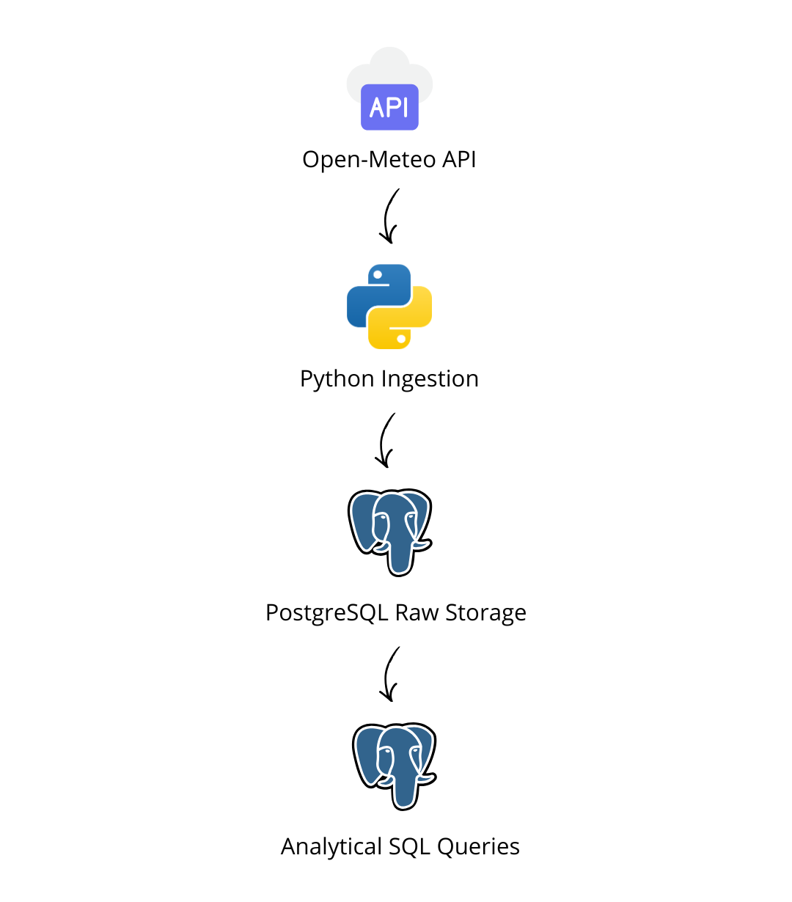

# Data API Pipeline

A portfolio project that demonstrates how to ingest data from an external API, store the data in PostgreSQL, and prepare it for analytics using SQL.

## Project Overview

This project simulates a small but realistic data engineering workflow for a company that wants to analyze external weather data for business planning and trend monitoring.

The pipeline collects historical weather data from a public API, loads it into a PostgreSQL database, and prepares the dataset for downstream analytical queries.

## Business Scenario

A company wants to monitor external data such as weather conditions to support operational and analytical decisions.

In this project, the selected external source is historical weather data. The pipeline stores daily metrics such as average temperature, maximum temperature, minimum temperature, and precipitation for a selected city and date range.

## What This Project Demonstrates

* API-based data ingestion using Python
* Environment-based configuration using `.env`
* PostgreSQL schema design for raw data storage
* Idempotent loading with `INSERT ... ON CONFLICT`
* A simple analytics layer using SQL views
* Business-oriented analytical queries
* Clear repository structure for reproducibility
* Production-style modular code organization

## Tech Stack

* Python 3.12.x
* Requests
* PostgreSQL
* SQL
* psycopg2-binary
* python-dotenv

## Data Source

This project uses the Open-Meteo historical weather API as the external data source.

## Architecture Summary

The project is intentionally designed as a compact end-to-end data engineering workflow:

1. extract historical weather data from a public API
2. validate and normalize the API response in Python
3. load the data into PostgreSQL using idempotent upsert logic
4. expose monthly aggregations through a reusable SQL view
5. answer business questions with analytical SQL queries

## Pipeline Flow



## Repository Structure

```text
data-api-pipeline/
│
├── docs/
│   └── pipeline-flow-data-api.png
│
├── ingestion/
│   ├── config.py
│   ├── api_client.py
│   ├── db.py
│   ├── load_weather_data.py
│   └── utils.py
│
├── database/
│   └── schema.sql
│
├── analysis/
│   ├── analytics_views.sql
│   └── analytical_queries.sql
│
├── .env.example
├── .gitignore
├── requirements.txt
└── README.md
```

## Environment Setup

This project was developed using **Python 3.12.x**.

### 1) Create virtual environment

```bash
python -m venv .venv
```

### 2) Activate virtual environment

**Windows (PowerShell)**

```powershell
.venv\Scripts\Activate.ps1
```

**Windows (CMD)**

```bat
.venv\Scripts\activate.bat
```

### 3) Install dependencies

```bash
pip install --upgrade pip
pip install -r requirements.txt
```

## Configuration

Create a local `.env` file based on `.env.example`.

Example:

```env
POSTGRES_HOST=localhost
POSTGRES_PORT=5432
POSTGRES_DB=data_api_pipeline
POSTGRES_USER=postgres
POSTGRES_PASSWORD=postgres

LATITUDE=-23.5505
LONGITUDE=-46.6333
CITY_NAME=Sao Paulo
START_DATE=2025-01-01
END_DATE=2025-01-10
```

## Database Setup

Create the PostgreSQL database first:

```sql
CREATE DATABASE data_api_pipeline;
```

Then apply the schema:

```bash
psql -U postgres -d data_api_pipeline -f database/schema.sql
```

## Database Design

The project uses a raw ingestion table:

* `analytics.raw_weather_history`

### Table Granularity

One row per:

* city
* weather date

### Stored Metrics

* `temperature_2m_mean`
* `temperature_2m_max`
* `temperature_2m_min`
* `precipitation_sum`

### Important Design Choices

* A dedicated `analytics` schema keeps the project organized
* A unique constraint on `(city_name, weather_date)` prevents duplicate daily records
* `ingested_at` supports ingestion auditability
* `ingestion_source` captures source traceability
* The raw table is intentionally preserved as the system-of-record for downstream analytics

## Running the Ingestion Pipeline

After the database schema is created and the `.env` file is configured, run:

```bash
python -m ingestion.load_weather_data
```

## What the Ingestion Pipeline Does

The ingestion pipeline:

1. loads environment variables
2. calls the Open-Meteo historical weather API
3. validates the API response structure
4. transforms daily arrays into row-based records
5. inserts or updates rows in PostgreSQL using upsert logic
6. prints a summary of processed rows

## Idempotent Load Behavior

The pipeline uses PostgreSQL `INSERT ... ON CONFLICT` logic to support safe reprocessing.

That means you can rerun the same date range for the same city without creating duplicate records.

This is an important production-style design choice because it makes the ingestion repeatable and resilient during development and testing.

## Example Validation Query

```sql
SELECT
    city_name,
    weather_date,
    temperature_2m_mean,
    temperature_2m_max,
    temperature_2m_min,
    precipitation_sum,
    ingested_at
FROM analytics.raw_weather_history
ORDER BY weather_date;
```

## Analytics Layer

The analytics layer is implemented with SQL views and business-oriented analytical queries.

### Analytics Views

The project includes a reusable monthly aggregation view built on top of the raw weather table:

* `analytics.vw_weather_monthly_summary`

This view supports:

* monthly average temperature analysis
* monthly maximum and minimum temperature tracking
* total monthly precipitation monitoring
* day counts and completeness checks

### Analytical Queries

The project also includes analytical SQL queries to answer common business questions such as:

* What is the monthly temperature trend?
* Which days were the hottest?
* Which days were the coldest?
* Which days had the highest precipitation?
* What was the total precipitation by month?
* Which days had the largest daily temperature range?

### Running the Analytics SQL

After loading the raw data, run:

```bash
psql -U postgres -d data_api_pipeline -f analysis/analytics_views.sql
psql -U postgres -d data_api_pipeline -f analysis/analytical_queries.sql
```

You can also open the SQL files in pgAdmin Query Tool and run them manually.

## Key Engineering Decisions

### 1) Public API selection

The project uses a public weather API so the repository is easy to reproduce without secrets or account setup.

### 2) Modular ingestion code

The Python ingestion layer is separated into configuration, API access, transformation, and database modules to improve readability and maintainability.

### 3) Raw-first storage design

The pipeline stores the API output in a raw relational table before analytics logic is applied. This reflects a common engineering pattern in production systems.

### 4) Idempotent database writes

The use of a unique constraint with upsert logic ensures that reruns do not create duplicate records.

### 5) Reusable analytics view

Instead of writing only one-off SQL queries, the project exposes a reusable monthly summary view that can support dashboards and future reporting layers.

## How to Showcase This Project

This project is a strong GitHub portfolio piece because it demonstrates:

* external data ingestion
* repeatable environment setup
* SQL-based storage design
* idempotent loading patterns
* analytical modeling with views
* business-facing query outputs

## Current Project Status

The project currently includes:

* repository bootstrap
* PostgreSQL raw schema
* Python ingestion pipeline
* environment configuration
* analytics views
* analytical SQL queries
* portfolio-ready documentation

The project is now fully structured as a compact end-to-end data engineering portfolio piece.

## Future Improvements

Possible future extensions for this project include:

* multi-city ingestion
* scheduling with cron or orchestration tools
* partitioning strategies for larger datasets
* analytical views for weekly and seasonal trends
* data quality checks for nulls and unexpected values
* dashboard integration with BI tools
* containerization with Docker

## License

This project is intended for portfolio and educational purposes.
